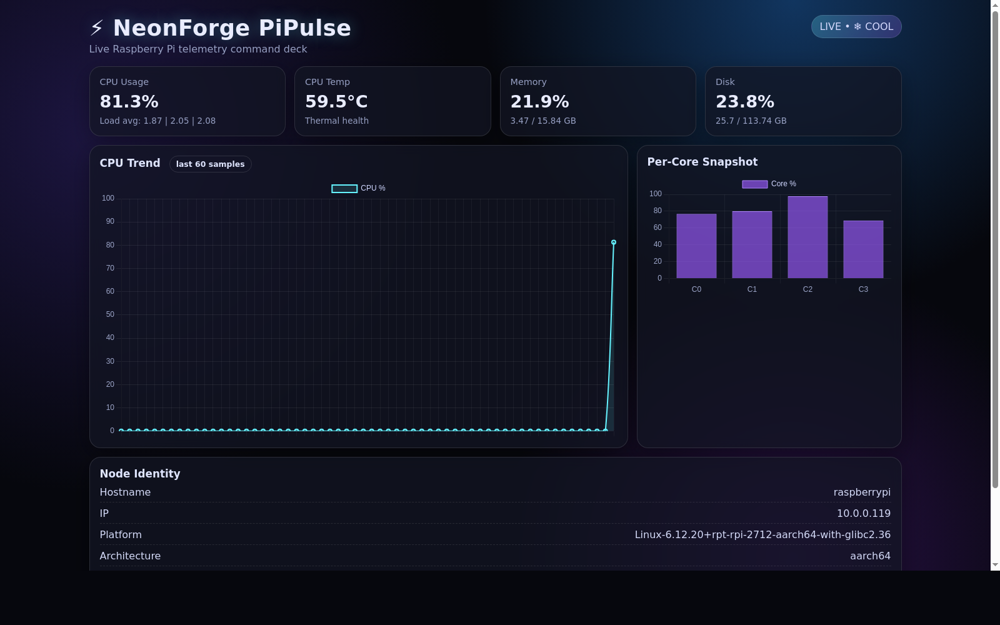

# ⚡ NeonForge PiPulse

A beautiful real-time Raspberry Pi telemetry dashboard built with **FastAPI**.

Monitor your Pi from any device on your local network using:

`http://<PI_IP>:8090`

---

## Features

- Live CPU usage (total + per-core)
- CPU temperature
- Memory and disk usage
- Load averages
- Network RX/TX counters
- Host identity and system info
- Neon-styled dashboard UI with Chart.js visualizations

---

## Tech Stack

- FastAPI
- Uvicorn
- Jinja2 templates
- psutil
- Chart.js

---

## Quick Start

```bash
cd /home/wkwats/NeonForge-PiPulse
python3 -m venv .venv
source .venv/bin/activate
pip install fastapi uvicorn jinja2 psutil
uvicorn app:app --host 0.0.0.0 --port 8090
```

Then open:

- Local on Pi: `http://127.0.0.1:8090`
- LAN: `http://<PI_IP>:8090`

---

## API

### `GET /`
Serves the dashboard page.

### `GET /api/stats`
Returns live telemetry JSON:

- CPU usage
- CPU temp
- load averages
- memory + disk stats
- network counters
- host/platform info

---

## Screenshot

> Add your screenshot here (recommended path: `assets/dashboard.png`)

```markdown

```

---

## Project Notes

Internal project tracker is kept in:

- `PROJECT_TRACKER.md`

---

## License

MIT (or your preferred license)
